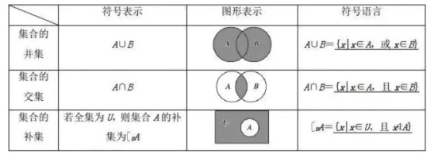

## 4.语句和量的定义

代码中的一切逻辑都是对<span class="e-1">量</span>的维护和使用，<span class="e-1">量</span>通过语句进行声明和赋值，通过<span class="e-1">函数/方法</span>的调用实现功能。

其实<span class="e-1">类</span>的本身，就是通过语句来维护<span class="e-1">量</span>和<span class="e-1">方法</span>，就是常说的<span class="e-1">成员属性</span>和<span class="e-1">成员方法</span>

```dart
// 2.我从哪里来？(在哪里)
void foo() {
  // 1.我是谁？(是什么)
  Person toly = Person('toly'); // 赋值语句
  // 3.我要到哪里去？(做什么)
  toly.say(); // 方法语句
}

class Persion() {
  final String name;

  Persion(this.name);

  void say() {
    print("我是 $name");
  }
}
```

我们一般把<span class="e-1">函数/方法调用</span>和<span class="e-1">声明/赋值</span>这两个基础语句，统称为<span class="e-1">表达式</span>。也就是说，通过它们向计算机表达最基础的诉求。

## 5.封装基础-函数方法的定义


编程中一般称<span class="e-1">匿名函数</span>为<span class="e-1">lambda表达式</span>。

<span class="e-1">回调函数</span>其本质就是利用函数类型作为方法入参，在何时的时机触发方法而已。

```dart
double result = add(3, 4, op: (double e) => e * e *e);
print(result);
```
通过<span class="e-1">函数类型</span>把函数对象化，可以更方便指代和操作。

---

### 3.函数的作用

函数的作用是什么？函数中可以集成若干语句，通过逻辑算法完成某项任务，这其实就是最基础的封装概念。当别人通过函数，封装了一个非常实用的功能，当这段代码被共享。你只需要调用函数即可，不必了解其中具体的实现细节，该函数对你来说就是一个实现某种功能的`黑盒子`

`这容易导致普通开发者过于依赖顶尖开发者分享的代码，从而无法提升自身的能力，无法理解其原理，缺乏自主思考的能力。`当出现问题或找不到库时，就举步艰难。

## 6.万物基石-基础数据类型

在面向对象的编程中，有句话叫`万物皆对象`。可以理解为，在程序中，一切都是对`量`的逻辑运算。而某类型决定了这种对象`有什么`,可以`做什么`。基础数据类型就是编程语言提供的内置类型。

### Set 集合

Dart 中集合使用<span class="e-1">{}</span>进行定义，通过<span class="e-1">,</span>来分隔元素。Set 和数学中集合的概念一样，可容纳若干个元素，且<span class="e-1">不包含相同元素</span>。Set 是无序的，没有索引的概念。

集合间的运算关系，即交集，并集，补集



```dart
Set<String> cnNumUnits = {"零", "壹", "贰", "叁", "肆", "伍", "陆", "柒"、"捌","玖", "拾"};
Set<String> part = {"零", "壹", "贰", "元", "角", "分"};

cnNumUnits.intersection(part); // 交集
// {"零", "壹", "贰"};

cnNumUnits.union(part); // 并集
// {"零", "壹", "贰", "叁", "肆", "伍", "陆", "柒"、"捌","玖", "拾",  "元", "角", "分"}

cnNumUnits.difference(part); // 补集
// {"叁", "肆", "伍", "陆", "柒"、"捌","玖", "拾"}
```

Set 的场景有聚合体中有元素不重复的需求，或者需要进行集合间的运算

### Map 映射