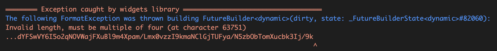
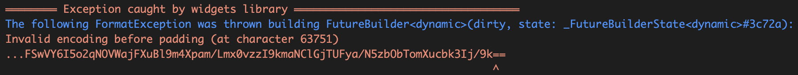

## 基础

## Base64 图片处理

### 使用
``` dart{16}
Widget cachedBase64Image(BuildContext context,
    {double? width, double? height}) {
  Future futrue = Dio().get(
      "Base64网络地址");
  return FutureBuilder(
    future: futrue,
    builder: (BuildContext context, AsyncSnapshot snapshot) {
      // 请求已结束
      if (snapshot.connectionState == ConnectionState.done) {
        if (snapshot.hasError) {
          // 请求失败，显示错误
          return Image.asset(ResourceFile.placeholder686And260);
        } else {
          // 请求成功，显示数据 snapshot.data
          // base64转码
          var url = const Base64Decoder().convert(snapshot.data.data);
          return Image.memory(url);
        }
      } else {
        // 请求未结束，显示loading
        return Image.asset(ResourceFile.placeholder686And260);
      }
    },
  );
```

### 注意 <Badge type="warning" text="waring"/>
在 Flutter 中使用 base64 图片的格式必须是<span class="main-color">4的倍数</span>,否则会遇到下面的报错。这个base64在web中使用是没有问题的，具体原因可以参考下面的参考链接



下面使用<span class="e-1">base64.normalize()</span>对base64进行规范化，这个方法主要就是对base64进行`=`号补位，但是好家伙啊！！！它竟然还报错，明明是它官方的规范方法，竟然还能报错。

``` dart{1}
String base64String = base64.normalize(snapshot.data.data);
var url = const Base64Decoder().convert(base64String);
```



::: warning
出于某种原因，dart:convert 的 base64.decode 在用 = 填充的字符串上阻塞，并出现“填充错误前的无效编码”。即使您使用包自己的填充方法 base64.normalize 会使用正确的填充字符 = 填充字符串，也会发生这种情况。
= 确实是 base64 编码的正确填充字符。当输入组中可用的位数少于 24 位时，它用于填充 base64 字符串。请参阅 RFC 4648，第 4 节。
但是，RFC 4648 第 5 节是 Urls 的 base64 编码方案，它使用下划线字符 _ 作为填充而不是 = 来确保 Url 安全。
使用 _ 作为填充字符将导致 base64.decode 解码无误。
为了进一步将生成的字节列表解码为 Utf8，您需要删除填充字节，否则您将收到“无效的 UTF-8 字节”错误。
[base64.decode: Invalid encoding before padding](https://stackoverflow.com/questions/66910584/base64-decode-invalid-encoding-before-padding)
:::

最终可运行代码

``` dart
String base64String = base64.normalize(snapshot.data.data).replaceAll("=", "_");
var url = const Base64Decoder().convert(base64String);
```


### 参考

- [How to convert BASE64 string into Image with Flutter?](https://stackoverflow.com/questions/46145472/how-to-convert-base64-string-into-image-with-flutter)
- [Base64:invalid length must be multiple of four : Error in flutter](https://stackoverflow.com/questions/63941130/base64invalid-length-must-be-multiple-of-four-error-in-flutter)