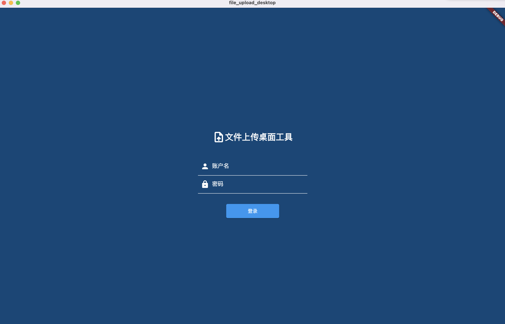
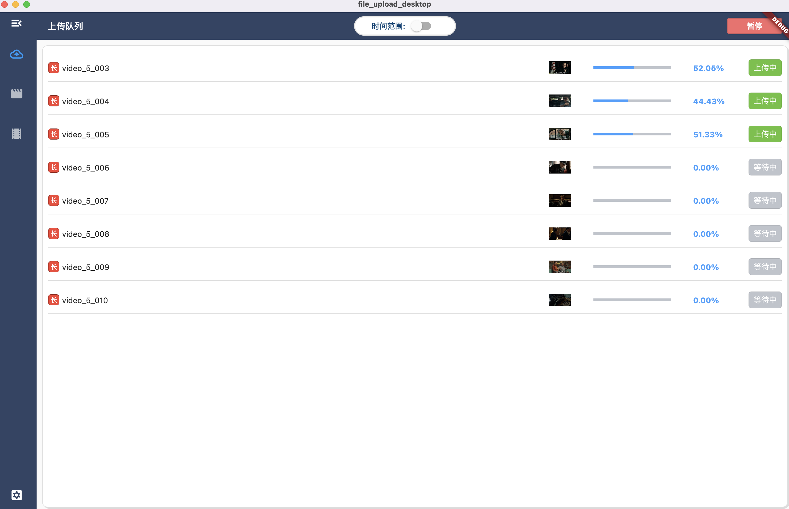
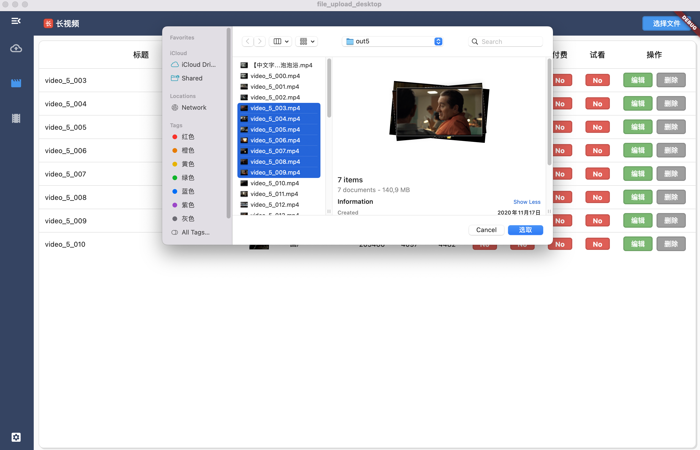
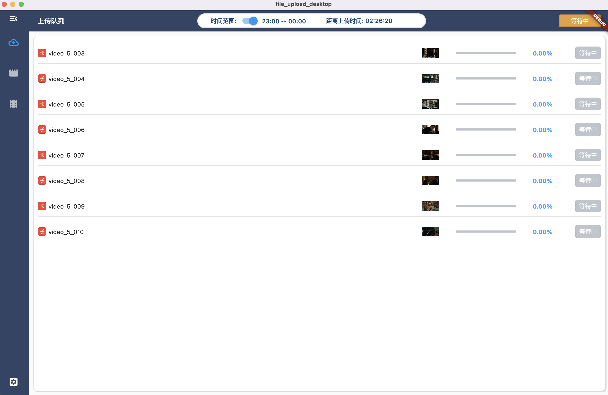

## 介绍

该工具是为了让运营人员方便上传视频资源到服务器而研发的。

一般项目的上传资源都是通过 web 网页的后台管理系统进行上传，网页的文件上传存在一些局限性，如较大的资源上传时间久，后台帐号 token 失效登出导致最终上传失败，上传时无法切换页面等。如果是小量资源上传也是没有问题的，主要还是看业务场景。

所以决定把上传功能单独抽离出来做成桌面工具。`其实我就是想使用 Flutter 编写一下桌面应用。哈哈哈`

使用 web 也能完全实现这些功能，使用浏览器自带的 indexDB 数据库缓存资源的上传数据，每次断点续传上传完文件得到资源地址之后，调用上传接口之前再调用一下登录接口就能保证 token 不会失效。其余的实现思路也是一样的。

### 项目截图





### 功能

- [x] 登入/登出
- [x] 自动登录
- [x] 时间倒计时
- [x] 时间范围上传
- [x] 数据编辑
- [x] 数据持久化
- [x] 上传进度展示
- [x] 批量文件处理
- [x] 多线程上传
- [ ] 上传成功/失败记录

## 思路

```text
逻辑流程:
1. 登录/权限验证/帐号/密码持久化
2. 上传类型选择(短视频 / 长视频)，默认长视频
3. 本地文件选择(上传中无法新增与编辑)
    1. 视频封面上传，
        1. 视频截取视频第一帧上传为视频封面
    2. 数据进入数据库
    3. 查询数据库显示数据表格
4. 数据信息编辑(上传中无法新增与编辑)
    1. 判断数据是否完整
        1. 是 —> 视频状态为：等待上传
        2. 否 —> 视频状态为：无法上传
5. 设置上传时间范围
6. 开始上传
    1. 判断上传状态是否为上传中
    2. 判断上传队列表是否存在数据
        1. 有 —> 继续走下一步
        2. 无 —> 把视频表中数据写进上传队列表，数据初始化
            1. 有 —> 继续走一下步
            2. 无 —>上传状态修改为“pause”，退出并内部弹框通知(请添加上传视频)
    3. 判断是否存在时间范围并在上传时间范围内
        1. 是 —> 继续走下一步
        2. 否 —> 不在上传时间范围内：(弹出”当前不在上传时间范围内，等待中…”)，开启定时器，计算当前时间到开始时间的差值，等待第六步执行，退出函数
    4. 判断是否为上传最大线程数
        1. 否 —> 继续走下一步
        2. 是 —> 退出
    5. 判断token是否过期
        1. 是 —> 继续走下一步
        2. 否 —> 走登陆流程，然后继续走下一步
    6. 从上传队列中挑选出第一个状态为“waiting”的数据
        1. 是 —> 继续走下一步
        2. 否 —> 退出任务
    7. 开启线程，开始上传
    8. 递归
```

## 第三方库

这个项目就是三方库的使用与缝合，自己主要还是业务的处理

- [GetX 状态管理](https://pub.dev/packages/get)
  - [GetX 中文文档](https://1467602180.github.io/flutter-getx-doc/quick-start)
  - [GetX Cli](https://github.com/jonataslaw/get_cli/blob/master/README-zh_CN.md)
- [dio HTTP请求库](https://pub.dev/packages/dio)
  - [dio 中文文档](https://github.com/cfug/dio/blob/main/dio/README-ZH.md)
- [file_picker 文件选择](https://pub.dev/packages/file_picker)
- [sqflite 数据库](https://pub.dev/packages/sqflite)
  - [flutter数据库sqflite使用方法，完整demo(增删改查,事务，批处理)](https://blog.csdn.net/qq_38507328/article/details/106097958)
- [data_table_2 表格](https://pub.dev/packages/data_table_2)
- [thumblr 桌面视频缩略图](https://pub.dev/packages/thumblr)
- ...

## JSON to dart model

- [Getx 生成model]()
- [https://app.quicktype.io/](https://app.quicktype.io/)

## 业务处理

### 文件选择

```dart
Future<List<Map>> onChooseVideoFile(
    {bool allowMultiple = true}) async {
  FilePickerResult? result = await FilePicker.platform
      .pickFiles(
        type: FileType.video, // 限制选择文件类型
        allowMultiple: allowMultiple // 是否允许多选
      );
  /// 选中操作
  if (result != null) {
    return result.files.map((item) {
      return {
        "videoName": item.name.substring(0, item.name.length - 4), // 去除后缀格式 .mp4，只保留文件名
        "path": item.path // 文件路径
      };
    }).toList();
  } 
  /// 取消操作
  else {
    return [];
  }
}
```

### 视频封面获取

视频封面获取使用了`thumblr`这个第三方库，最初的思路还停留在 web 端的实现思路上，先播放视频，然后使用`canvas`等方式进行页面截图。但是在 macOS 系统上根本无法进行视频播放，导致在这个功能实现上卡了我2天。

其实我只是想要视频的第一帧作为封面，换一种思路，借助某些工具就可以了。

```dart {7-10}
/// 获取视频第一帧作为封面
/// 1. 从本地视频中截取第一帧
/// 2. 图片压缩
/// 3. 图片上传返回 URL 地址
Future<String?> getThumbnail(String filePath) async {
  try {
    // 1.获取第一帧
    Thumbnail thumb = await generateThumbnail(
      filePath: filePath, // 本地文件路径
      position: 0, // 视频位置
    );
    // 2.图片压缩
    final data = await compressImage(thumb.image);
    // 3.上传获取图片地址
    UploadModel? response = await UploadAPI.uploadByteFile(byteData: data);
    if (response!.code == 0) {
      return response.data.path;
    } else {
      return null;
    }
  } on PlatformException catch (e) {
    debugPrint('Failed to generate thumbnail: ${e.message}');
  } catch (e) {
    debugPrint('Failed to generate thumbnail: ${e.toString()}');
  }
  return null;
}
```

#### thumblr 实现原理

#### 使用`thumblr`的时候需要注意的点：

1. 开启系统文件的读的权限 `/macos/Runner/DebugProfile.entitlements` 和 `/macos/Runner/ReleaseProfile.entitlements`

`DebugProfile.entitlements` 本地开发的环境

`ReleaseProfile.entitlements` 发布的环境
```js
<key>com.apple.security.files.user-selected.read-only</key>
<true/>
```
或者
```js
<key>com.apple.security.files.user-selected.read-write</key>
<true/>
```
2. macOS系统需要关闭`沙箱`授权，否则无法操作文件

```js
<key>com.apple.security.app-sandbox</key>
<false/> // 关闭
```

### 图片压缩处理

```dart
/// 返回二进制列表
Future<Uint8List> compressImage(ui.Image image) async {
  final completer = Completer<Uint8List>();
  final byteData = await image.toByteData(format: ui.ImageByteFormat.png);
  final pngBytes = byteData!.buffer.asUint8List();

  ui.instantiateImageCodec(
        pngBytes,
        targetHeight: image.height ~/ 2,
        targetWidth: image.width ~/ 2) // 除2减少图片尺寸，从而减少图片体积
      .then((codec) {
    return codec.getNextFrame();
  }).then((frame) async {
    final pngBytes = await frame.image.toByteData(
      format: ui.ImageByteFormat.png);
    completer.complete(pngBytes!.buffer.asUint8List());
  }).catchError((error) => completer.completeError(error));
  return completer.future;
}
```

### 使用Isolate断点续传

断电续传，也就分片上传。就是一点一点的上传文件

```dart
static void uploadVideoIsolate(params) async {
  // 开始上传
  File file = File(params[0]['videoUrlFs'] ?? params[0]['videoUrl']);
  var sFile = await file.open();

  try {
    int fileLength = sFile.lengthSync();
    int chunkSize = 1024 * 1024;
    int x = 0;
    int offset = 0;
    String fileMD5 = "";

    while (x < fileLength) {
      // 是否为最后一片
      bool isLast = fileLength - x >= chunkSize ? false : true;
      // 最后一次
      int len = isLast ? fileLength - x : chunkSize;
      // 获取一片
      Uint8List fileBlock = sFile.readSync(len);
      // 第一片 MD5加密
      if (fileMD5 == "") {
        fileMD5 = UtilsTools.upsetString(md5.convert(fileBlock).toString());
      }

      // 将分出来的 bytes 上传
      var result = await UploadAPI.uploadFileBlock(
          fileBlock: fileBlock,
          fileLength: fileLength,
          offset: offset,
          chunkSize: len,
          fileMD5: fileMD5,
          headerToken: params[2],
          userId: params[3]);

      // 相应结果返回
      if (result!.code == 0) {
        // 持续上传中
        if (result.data.status == 100) {
          var progress = result.data.offset / fileLength >= 1
              ? 1
              : result.data.offset / fileLength;
          params[1].send({
            "info": "upload_progress",
            "progress": progress,
            "videoId": params[0]['id']
          });
          offset = result.data.offset;
        }
        // 上传成功
        else if (result.data.status == 0) {
          if (params[0]['videoType'] == 2) {
            params[0]['videoUrlFs'] = result.data.path;
          } else {
            params[0]['videoUrl'] = result.data.path;
          }
          params[1].send({"info": "upload_success", "data": params[0]});
        }
        // 上传失败
        else {
          params[1].send({
            "info": "upload_error",
            "data": params[0],
            "errorData": result.data
          });
          break;
        }
      }

      x += len; // 记录已经取出来的长度
    }
  } catch (e) {
    print(e);
    params[1].send(e);
  } finally {
    sFile.close();
    Isolate.exit(params[1], "Isolate finally");
  }
}
```

## 项目打包/调试

- [Build Flutter 3.0 MacOS apps and games — DMG installer](https://medium.com/flutter-community/build-flutter-macos-apps-and-games-dmg-installer-f8ced960ced)